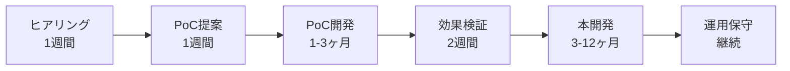

# 3. AI・IoTソリューション開発事業

*最終更新: 2025年9月10日*

## 🎯 サービス概要

**アイデアを、画面の中から現実の世界へ。**

ブラウザ上のAIエージェントから、ドローンやロボットといった物理デバイスまで。貴社の課題を解決するため、ソフトウェアとハードウェアの垣根を越えた最適なAI・IoTソリューションをワンストップで開発します。

## 📊 料金体系（税込）

| サービス | 価格帯 | 期間 | 内容 |
|---------|--------|------|------|
| **PoC（概念実証）** | **100万円〜500万円** | 1-3ヶ月 | リスクを抑えたスモールスタート |
| **本開発** | **500万円〜** | 3-12ヶ月 | PoCの結果を基に本格実装 |
| **保守・運用** | **月額10万円〜** | 継続 | システムの安定稼働支援 |

### 🤝 共創パートナー優待制度
Cor.株式会社の他サービスをご利用中のお客様には、長期的なパートナーシップに基づく特別価格でご提供しています。

## 🛠️ 開発可能なソリューション

### AIソリューション

| カテゴリ | 具体例 | 活用技術 | 期待効果 |
|---------|--------|---------|---------|
| **業務自動化AI** | 文書処理、データ入力自動化 | GPT-4、Claude、独自LLM | 作業時間80%削減 |
| **予測・分析AI** | 需要予測、異常検知 | 機械学習、時系列分析 | 精度95%以上 |
| **対話型AI** | カスタマーサポート、社内FAQ | RAG、ファインチューニング | 問い合わせ70%削減 |
| **画像認識AI** | 品質検査、在庫管理 | YOLO、Vision Transformer | 検査速度10倍 |
| **音声AI** | 議事録作成、音声コマンド | Whisper、音声合成 | 文字起こし時間90%削減 |

### IoTソリューション

| カテゴリ | 具体例 | 使用デバイス | 期待効果 |
|---------|--------|------------|---------|
| **環境モニタリング** | 温湿度管理、CO2測定 | M5Stack、Raspberry Pi | エネルギー30%削減 |
| **位置追跡** | 資産管理、動線分析 | GPS、BLEビーコン | 紛失率90%削減 |
| **予知保全** | 設備故障予測 | 振動センサー、音響センサー | ダウンタイム50%削減 |
| **ドローン活用** | 点検、測量、配送 | DJI SDK、自律飛行 | 作業時間70%削減 |
| **ロボティクス** | 搬送、介護支援 | ROS、協働ロボット | 人的負担60%軽減 |

## 💡 差別化ポイント

### 1. **ソフトウェアからハードウェアまでワンストップ**

| 開発範囲 | 一般的なIT企業 | Cor.株式会社 |
|---------|--------------|------------|
| Webアプリ | ✅ | ✅ |
| モバイルアプリ | ✅ | ✅ |
| AI/機械学習 | △（外注） | ✅ |
| IoTデバイス | ❌ | ✅ |
| ドローン制御 | ❌ | ✅ |
| ロボット制御 | ❌ | ✅ |

### 2. **鉄壁のデータセキュリティ**

```
🔒 ローカルLLM活用の利点
━━━━━━━━━━━━━━━━━━━━━
• クラウドに機密情報を送信しない
• GDPR/個人情報保護法に完全準拠
• 通信コスト・遅延ゼロ
• 完全オフライン環境でも動作
━━━━━━━━━━━━━━━━━━━━━
```

### 3. **専門家との連携体制**

| 専門分野 | 連携パートナー | 提供価値 |
|---------|--------------|----------|
| **農業** | 農業法人、農機メーカー | 実践的な営農支援システム |
| **福祉** | 介護施設、福祉機器メーカー | 現場の声を反映した支援技術 |
| **海洋** | 港湾事業者、造船会社 | 海事特有の課題解決 |
| **ローカルAI** | 研究機関、大学 | 最先端技術の実装 |

## 📈 導入プロセス

### スモールスタートで確実な成果を



### 各フェーズの詳細

| フェーズ | 期間 | 成果物 | 投資額 |
|---------|------|--------|--------|
| **1. ヒアリング** | 1週間 | 課題整理書 | 無料 |
| **2. PoC提案** | 1週間 | 提案書・見積 | 無料 |
| **3. PoC開発** | 1-3ヶ月 | 動作デモ・検証レポート | 100-500万円 |
| **4. 効果検証** | 2週間 | ROI分析書 | PoC費用に含む |
| **5. 本開発** | 3-12ヶ月 | 本番システム | 500万円〜 |
| **6. 運用保守** | 継続 | 月次レポート | 月額10万円〜 |

## 🎯 対応可能な業界・用途

### 製造業
- 品質検査の自動化
- 予知保全システム
- 生産ライン最適化
- 在庫管理の効率化

### 物流・運輸
- 配送ルート最適化
- ドローン配送
- 倉庫内ロボット
- トラッキングシステム

### 農業
- スマート農業（精密農業）
- 収穫予測
- 病害虫検知
- 自動灌漑システム

### 医療・福祉
- 見守りシステム
- リハビリ支援
- 服薬管理
- バイタルモニタリング

### 小売・サービス
- 来店客分析
- 在庫最適化
- 接客ロボット
- 需要予測

## 🌍 実績・事例

### 導入事例1: 港湾音声文字起こしシステム

| 項目 | 詳細 |
|------|------|
| **課題** | 無線音声の手動文字起こしに1日3時間 |
| **ソリューション** | ローカルAI音声認識システム |
| **効果** | 作業時間90%削減、精度95% |
| **投資額** | PoC 200万円 → 本開発 800万円 |

### 導入事例2: 介護施設見守りシステム

| 項目 | 詳細 |
|------|------|
| **課題** | 夜間の見回り負担、プライバシー配慮 |
| **ソリューション** | カメラレス・AIセンシング（M5Stack） |
| **効果** | 誤報80%削減、離床検知100% |
| **投資額** | PoC 150万円 → 本開発 500万円 |

### 導入事例3: 風力発電機点検ドローン

| 項目 | 詳細 |
|------|------|
| **課題** | 高所作業の危険性、点検コスト |
| **ソリューション** | AI画像解析付き自律飛行ドローン |
| **効果** | 点検時間70%削減、事故ゼロ |
| **投資額** | PoC 300万円 → 本開発 1,200万円 |

## 🚀 今後の展開

### 研究開発中の技術

- **エッジAI**: より高速・低遅延な処理
- **5G/6G連携**: 超高速通信での制御
- **デジタルツイン**: 仮想空間でのシミュレーション
- **量子コンピューティング**: 最適化問題の革新的解決
- **ブレインマシンインターフェース**: 思考による機器制御

## 📞 お問い合わせ

まずは無料相談から。貴社の課題をお聞かせください。
技術的な実現可能性から投資対効果まで、誠実にご提案いたします。
